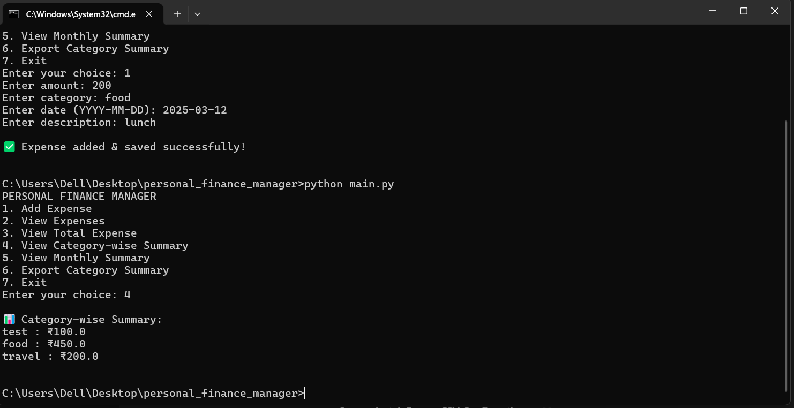

# Personal Finance Manager

## Project Overview
Personal Finance Manager is a Python-based console application developed as part of an internship task.
The project helps users manage their daily expenses by allowing them to record, view, and analyze spending data.

The application stores expense data in CSV files, making it lightweight and easy to use without requiring a database.
It provides clear summaries such as category-wise and monthly expense reports to help users understand their spending habits.

---

## Features
- Add new expenses with amount, category, date, and description
- View all recorded expenses
- View total expense amount
- View category-wise expense summary
- View monthly expense summary
- Export category summary to CSV file

---

## Technologies Used
- Python 3
- CSV file handling
- Command Line Interface (CLI)

---

## Technical Details

- Programming Language: Python
- Data Storage: CSV files
- Concepts Used:
  - File handling
  - Functions and modular programming
  - Lists and dictionaries
  - Date handling
  - User input validation

---

## Setup Instructions
Follow the steps below to run the project on your system:

1. Install Python 3 on your system
2. Download or clone this repository
3. Open terminal or command prompt
4. Navigate to the project folder
5. Run the program using:
    python main.py

   
---

## Code Structure
personal-finance-manager/
│
├── main.py # Main program with menu and user interaction
├── expense.py # Expense-related functions
├── expenses.csv # Stores all expense data
├── category_summary.csv # Exported category-wise summary
├── README.md # Project documentation

---

## Sample Output
PERSONAL FINANCE MANAGER

1. Add Expense

2. View Expenses

3. View Total Expense

4. View Category-wise Summary

5. View Monthly Summary

6. Export Category Summary

7. Exit
   
---

## Testing
The application was tested manually by:
- Adding multiple expenses
- Checking total expense calculation
- Verifying category-wise summary
- Verifying monthly summary output

---

## Future Improvements
- Add graphical user interface (GUI)
- Add user authentication
- Add data visualization charts
- Support database storage instead of CSV

  ---

  ## Screenshots

## Screenshots

### Main Menu

### Add Expense

### Category Summary

### Export CSV

---

## 🚀 How to Run the Project

### Prerequisites
- Python 3.10 or higher installed
- Command Prompt / PowerShell

### Steps to Run
1. Download or clone the repository
2. Open Command Prompt / PowerShell
3. Navigate to the project folder:
    cd Desktop\personal_finance_manager
4. Run the program:
   
### Menu Options
1. Add Expense
2. View Expenses
3. View Total Expense
4. View Category-wise Summary
5. View Monthly Summary
6. Export Category Summary
7. Exit

---

## 📂 Project Structure

personal-finance-manager/
│
├── main.py  
│   Entry point of the application.  
│   Handles user menu and program flow.
│
├── expense.py  
│   Contains functions related to expense operations such as:
│   - Adding expenses
│   - Viewing summaries
│   - Exporting data
│
├── expenses.csv  
│   Stores all expense records entered by the user.
│
├── category_summary.csv  
│   Stores category-wise expense summaries exported by the program.
│
├── screenshots/  
│   Contains screenshots showing the working of the application.
│
└── README.md  
    Project documentation.

---

## 🎯 Learning Outcomes

- Learned how to build a complete Python project from scratch
- Improved understanding of file handling using CSV files
- Practiced writing clean, modular, and reusable code
- Gained experience in documenting a project professionally
- Understood how to use GitHub for version control and project submission

---

## Author
Sadaf 
